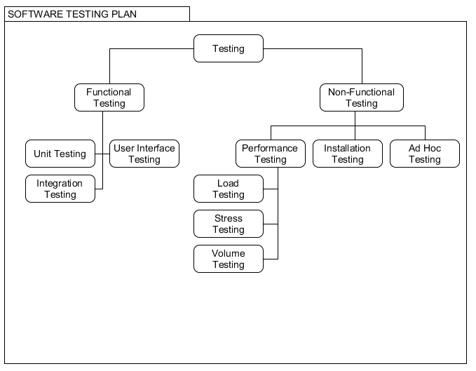

  
# Clever Carpooling || README ||

**Repository Information:**
Clever Carpooling is an application to be used by students and commuters to fill up available space in cars, thereby reducing traffic and contributing to a greener community. The project we plan on undertaking is creating an Android application which focuses on carpooling and the user specifically being students and commuters to work etc.

**Project Exposition Summary:**
Clever Carpooling is an Android application which aims to facilitate and improve navigation and peer-to-peer ridesharing, utilising Google Maps API. Users may sign up as either a driver or a passenger, or both. Drivers may 'post' a route which they plan on undertaking, and passengers may request a lift if they are going anywhere on that same route within a given distance. Clever Carpooling has many applications to our society as a whole, including helping to attack the climate problem, and making student/commuter life easier, to name but a few.

## Links to our Deliverables

**Functional Spec**     - [https://gitlab.computing.dcu.ie/guvenn2/2020-ca400-nguven-scarey/blob/master/docs/functional-spec/functional_specification_NigelShaun.pdf](https://gitlab.computing.dcu.ie/guvenn2/2020-ca400-nguven-scarey/blob/master/docs/functional-spec/functional_specification_NigelShaun.pdf)
                    
**Technical Manual**    - [https://gitlab.computing.dcu.ie/guvenn2/2020-ca400-nguven-scarey/blob/master/docs/documentation/CA400_Technical_Manual.pdf](https://gitlab.computing.dcu.ie/guvenn2/2020-ca400-nguven-scarey/blob/master/docs/documentation/CA400_Technical_Manual.pdf)

**User Manual**         - [https://gitlab.computing.dcu.ie/guvenn2/2020-ca400-nguven-scarey/blob/master/docs/documentation/CA400_User_Manual.pdf](https://gitlab.computing.dcu.ie/guvenn2/2020-ca400-nguven-scarey/blob/master/docs/documentation/CA400_User_Manual.pdf)

**Video Walkthrough**   - [Youtube Link](https://www.youtube.com/watch?v=VEZHKLOzXYo)

**Testing Manual**      - [https://gitlab.computing.dcu.ie/guvenn2/2020-ca400-nguven-scarey/blob/master/docs/documentation/CA400_Testing_Manual.pdf](https://gitlab.computing.dcu.ie/guvenn2/2020-ca400-nguven-scarey/blob/master/docs/documentation/CA400_Testing_Manual.pdf)

### Prerequisites

**JDK 8**           - Latest Java develepmont tools coordinated with Android    - http://www.oracle.com/technetwork/java/javase/downloads/jdk8-downloads-2133151.html

**Android Device**  - The application is supported for Android only. The original plan was to also develop on iOS but with time-constraints and external factors this is not possible.

### Tools and API usage

**FusedAPI**        - Location Provider

**Firebase MLKit**  - Image Text Recognition(OCR)

**MotorCheckAPI**   - Car Details based on A Car Registration, (technically not an API call but being scraped by JSoup)

**Google Maps API** - Google Map

**Directions API**  - GCP Route Directions

**Geocoding API**   - GCP Get string address based on coordinates

**FirebaseUI**      - Open source tools for aiding Firebase document retrieval and display

**VolleyLib**       - Easy API embedding, eliminating the need for multiple classes

**HdoDenHof**       - Circular ImageViews in XML

**JSoup**           - Web scraping of motorcheck API url html

**Android Studio**  - The tools provided for developing Android Applications    - https://developer.android.com/studio/index.html

**UMLet**           - Systems Analysis & Design                                 - http://www.umlet.com/

### Installing

1.	Prerequisites:
    a.	Android Studio is installed on the user’s development environment.
    b.	ADB is installed on the user’s device.

2. Download the project in this repository
3. With Android Studio home interface, find the application, be default in the Downloads folder.
4. The application will build itself and you should be able to run it from the toolbar at the top. 
5. Make sure to have an Android emulator installed or connected with a physical device by USB or Wifi
6. Once clicking the Run button in the toolbar, the application should run on the device.

## Testing | Validation | User Review

Testing is being performed in two areas: Functional and Non-Functional tests. The diagram shows our testing tree.

## Built With

* [Android Studio](https://developer.android.com/studio/index.html) - Building the Android App, GUI

* [Firebase](https://firebase.google.com/) - Firebase Blaze plan: Back-end databases, Machine Learning, Storage of user data, pictures, routes, etc

* [Google Cloud Platform](https://cloud.google.com/) - All Google Maps API calls and Firebase billing. Provided $270 free credit to use.

* [Java](https://www.java.com/en/) - Primary programming language, Development and testing with JUnit

* [XML](https://en.wikipedia.org/wiki/XML) - Layout of UI objects and transportation of data.

## Authors

* **Project Manager: Shaun Carey** 

* **Project Manager: Nigel Guven** 

* **Supervisor: Ray Walshe** 

## Acknowledgments

* Ray Walshe, our supervisor who gave us fresh ideas to implement into our project.
* Motorcheck API for allowing us to use their API free of charge to collect car registration data.
* JSoup for providing java developers across the Earth with utilities for software development.
* Firebase for providing clean, smooth interaction with Android applications.
* Google and specifically GCP for providing us with a free trial and $270 of free credit to use their API's.
