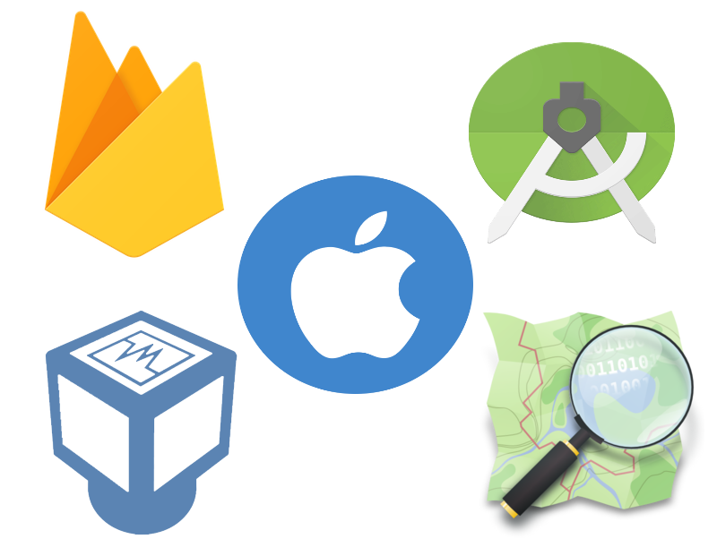

# School of Computing &mdash; Year 4 Project Proposal Form

## SECTION A

|                     |                   |
|---------------------|-------------------|
|Project Title:       | Clever Carpooling            |
|Student 1 Name:      | Nigel Guven           |
|Student 1 ID:        | 14493422            |
|Student 2 Name:      | Shaun Carey            |
|Student 2 ID:        | 16450454            |
|Project Supervisor:  | Ray Walshe           |

  

## SECTION B

### Introduction

The application that we are developing for our 4th year project will be made for Android and iOS mobile systems. 

Android is the worlds largest and most popular mobile operating system and is roughly 70% of the market. iOS is at 20% approx.
The specific area that we are focusing on involves navigation, peer-to-peer ridesharing and ultimately our goal is to create a new and innovative method of transport options.
The application is called Clever Carpooling. We are planning to develop this system for Android and iOS mobile systems and involve the use of the OpenStreetMap API. 

We have chosen OpenStreetMap over other mapping services for the following reasons:

1.	OSM is a purely volunteer based project.
2.	OSM is arguably better for areas with less developed infrastructure which might make it preferable for our application. There is an interesting article in regards to the dedication of the OpenStreetMap volunteer base in mapping out the infrastructure of North Korea. https://geoawesomeness.com/open-street-map-was-faster-in-mapping-north-korea-than-google-maps/
3.	We would like to learn the OSM API.
4.	Nicer, cleaner map.

### Outline

The user will be presented with the application which they may create an account with. They must fill in their personal details and take a picture of themselves. 

Upon logging in, the user can view the map and can either select a destination that they will be going to or search the map for vehicle owners who have already selected a destination. The user can request a lift from a driver if they happen to be going in a similar direction. 

Otherwise, other users may request a lift and can be accepted or rejected. Users may be able to search by time and place as an additional function.

### Background

The idea came about from constantly seeing friends post on social media (namely Facebook) about asking for lifts at specific times if "you are heading that way", and also from the concept of lifts in general.

We wanted to build an easy-to-use application which incorporates all of this into one location; an app where users can specifically search for lifts depending on if another user has posted that they *are* in fact going from A to B at a certain time. Other more obvious inspirations include the Uber and Lyft apps.

### Achievements

As briefly mentioned, if a user is going from point A to point B tomorrow morning at 9am, they can post that fact. Not a social media style post per se, but a searchable ‘entry’ into the application. They will also be able to opt to post the route that they are taking.

Any user who lives along, or close to, that route, and whose destination is point B, can search for these parameters and request a lift. 

There will be no monetary purchases involved, friendly users can choose to pay their lift (or not) in person when it is completed. This idea also ties in nicely to the recent topical discussions on climate change, and can definitely help contribute for the better.

We expect main users to be commuters for obvious reasons, but the app will be usable by the majority, if not all, of the population, for one time lifts and such.

### Justification

Clever Carpooling has many applications into our society as a whole.

- The Environment

- Student Life made easier

- Commuter Life made easier

- Less dependence on public transport which can be unreliable

### Programming language(s)

Java is the primary language of Android Studio.

Xamarin for building platform for building applications on Android and iOS.

C Sharp is the development language of Xamarin. Utilised it on INTRA.

Swift is the primary language for iOS development, should we decide to develop for iOS as well.

Open Street Maps API is written in JavaScript so we will be using this is some aspect.

### Programming tools / Tech stack

  

Firebase will be used for any database related work.

Xamarin will be the primary development tool for building the application.

Since we do not have access to any Apple devices to develop the application for iOS, we will be using VirtualBox to create a virtual machine with macOS to develop the iOS side of the application.

### Learning Challenges

We are both already quite familiar with Android Studio, however neither of us have ever developed an iOS app. As mentioned previously, should we decide to make this an iOS application on top of Android, we will have to do some research into that, as well as the Swift programming language.

Firebase provides a realtime database and backend as a service. Since we plan on using this, some research into it will have to be undertaken.

Using Xamarin will be a new experience and will give us experience into cross platform development tools.

Having used Google Maps previously, this time we are opting for OpenStreetMaps. OSM is a collaborative project to create a free editable map of the world. We really look forward to learning how to work with this.

We will need to learn how to use VirtualBox and also how to sync up mobile applications in two different operating systems. 

### Breakdown of work

#### Student 1 - Nigel Guven

I will be developing the maps segment and any map-related activities with regards to user interactivity. I possess an Android phone and have experience with Android app development and so my phone will be used for testing on the Android side.

I used C# on INTRA so I have experience with it when building the application on Xamarin.

#### Student 2 - Shaun Carey

With Nigel handling a lot of the backend, I will be performing the majority of frontend work for the application, such as any JavaScript which may be needed. This will also include any small graphic design which may need to be undertaken as I have quite a bit of experience with Photoshop and related tools.

I will also be undertaking most of the Firebase data related work, as it is my preferred area of computer science as a whole. This includes the sign-up and login section of the application, as well as the storage of user data.

Since I own an iPhone, I will be testing the iOS version of the project.

